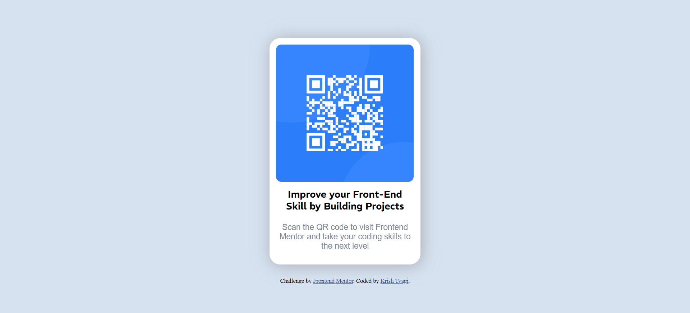

# Frontend Mentor - QR code component solution

This is a solution to the [QR code component challenge on Frontend Mentor](https://www.frontendmentor.io/challenges/qr-code-component-iux_sIO_H). Frontend Mentor challenges help me improve my coding skills by building realistic projects. 

## Table of contents

- [Overview](#overview)
  - [Screenshot](#screenshot)
  - [Links](#links)
- [My process](#my-process)
  - [Built with](#built-with)
  - [What I learned](#what-i-learned)
  - [Continued development](#continued-development)
  - [Useful resources](#useful-resources)
- [Author](#author)
- [Acknowledgments](#acknowledgments)

## Overview

### Screenshot

### Links

- Solution URL: [Add solution URL here](https://your-solution-url.com)
- Live Site URL: [Add live site URL here](https://your-live-site-url.com)

## My process

### Built with

- Semantic HTML5 markup
- CSS custom properties
- Flexbox
- Responsive
- [Google Fonts](https://fonts.google.com/) - For fonts

### What I learned

This project help me recap over some of my major learnings while working through this project. And help me to use my html and css knowledge practially to built something.

### Continued development

CSS grid , javascript are the areas that i want to continue focusing on in future projects. These are the concepts those i am still not completely comfortable with and techniques i found useful that i want to refine and perfect.To become a full stack frontend developer. And later on i want to larn backend technologies to bacome the full stack web developer

### Useful resources

- [resource 1](https://www.youtube.com/watch?v=Vi9bxu-M-ag&list=PLDzeHZWIZsTo0wSBcg4-NMIbC0L8evLrD&pp=iAQB) - This is web development yt couse of love babbar bhaiya from where i start my web developent learning .
This help me a alot to learn html and css (in progres)
- [resource 2](https://www.w3schools.com/) - This is a website name W3School help to revise my learned concepts but helpfull of html and css. I'd recommend it to anyone still learning this concept.

## Author

- LinkdIn - [Krish Tyagi](www.linkedin.com/in/krish-tyagi-1453a0275)
- Frontend Mentor - [@krish-tyagi](https://www.frontendmentor.io/profile/krish-tyagi)

## Acknowledgments

I want yo thanks love babbr bhaiya for creating premium content of web devlopment free on yt . Thats help me a lot in learing web development . 
